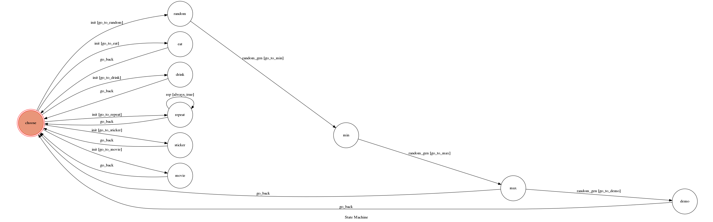

# TOC Project 2019

功能說明
-------------------------------
一開始可以輸入
1. random
* 接著照指示輸入最大最小值
* 輸出為一個範圍內的random number
2. eat
* 隨機回答一個食物
3. drink
* 隨機回答一杯飲料
4. repeat
* 會重複你說的話
* 輸入exit離開
5. [按讚]
* 回答你: thanks for your like
6. movie
* 回答你最新電影名單: [ref](https://movies.yahoo.com.tw/)

環境設定與介紹
-------------------------------
#### clone下來後的僅須一次:
1. 環境安裝
```sh
pip3 install -r requirements.txt
```
2. 取得粉專token(xxx)(從developer取得)，存在本機端(若重新產生token，則需要再打一次)  
  而且export儲存的位置僅限開啟的那個terminal(關掉就沒了)
```sh
export ACCESS_TOKEN=xxx
```
然後在需要的程式碼裡面打上這段來取得  
ACCESS_TOKEN = os.environ.get("ACCESS_TOKEN")

#### 環境需求
* Python 3 (透過$python3 -V 看版本)
* Facebook Page and App (創一個粉專並且盡到FB developer做一些設定)
* HTTPS Server (看下面的ngrok)

#### ngrok介紹
ngrok是一個可以將local端的server連到外面的辦法  
透過以下這段程式碼，可以得到https的網址，這個網址給別人，別人就可以跟local端互動
```sh
./ngrok http 5000
```

即使是要https，一樣是打http
5000為port，須跟程式碼裡設定一樣  
run(host="localhost", port=5000, debug=True, reloader=True)

#### 主程式碼介紹
app.py做以下幾件事  
(1)一開始的webhook設定  
(2)接收request  
(3)呼叫fsm.py做處理  
(3)從fsm.py呼叫utils.py回傳訊息給messenger user  
```sh
python3 app.py
```

Local端執行教學(使用ngrook)
-------------------------------
### 每次使用須執行:
1. $export PORT=5000
2. $export ACCESS_TOKEN="你的粉專權杖"
3. $./ngrook http 5000  (ngrook需去官網下載，放在同資料夾下)
4. $python3 app.py
5. 到FB developer的產品的webhook，選擇"page"的subscribe。webhook的網址從1.取得，token打123(app.py裡的設定)
6. 開始用粉專傳訊息 (由管理員傳才會有回應)(權限問題)
* 3.跟4.要開著，不能關掉

PaaS使用教學(使用Heroku)
-------------------------------
### 額外所需文件:(放在同目錄下)
1. Procfile: 告訴heroku要怎麼執行我的程式
2. Aptfile: 告訴heroku需要安裝些甚麼
3. requirements.txt: 安裝指示
### 事前準備:
1. 先去Heroku辦帳號及創建App
2. install heroku
3. $heroku buildpacks:set heroku/python
4. $heroku buildpacks:add --index 1 heroku-community/apt
5. $heroku login
6. $git init
7. $heroku git:remote -a toc-project-2019
8. git push上去
  
* 程式碼也需要改成(port不能寫死)  
  import os  
  PORT=os.environ['PORT']  
  run(host="0.0.0.0", port=PORT, debug=True, reloader=True)
  * 如果是本機段要用的話記得加上 $export PORT=5000

* $ heroku config:set ACCESS_TOKEN=你的粉專 access token  
### 每次使用須執行:
1. git push最新的上去到heroku(注意不是github喔，除非有connect)
2. 開始用粉專傳訊息 (由管理員傳才會有回應)(權限問題)  
* 不一定需要(重新設定才要): 到FB developer的產品的webhook，選擇"page"的subscribe。webhook的網址從去heroku取得，token打123(app.py裡的設定))
* https://toc-project-2019.herokuapp.com/

Finite State Machine
-------------------------------


Note
-------------------------------
1. !!!如果感覺都對了，但是傳messenger訊息卻沒有反應->去developer重新設定(webhook設定還有訂閱都重來)!!!
2. !!!產品的Webhook記得是要選page，不是user(重新訂閱時要選好)!!!
1. app.py中一開始的webhook設定的token可以隨便打，跟FB developer設定一樣就好  
2. 可是utils.py中要send回去給messenger時，就需要用粉專的token(從FB developer的權杖產生取得)  
3. 資料夾中的demo只是練習(不完整)，無法跟messenger聯絡  
4. FB developer要注意的地方  
(1)左邊的產品的勾勾都要是綠色  
(2)產品Messenger的設定的webhook要記得訂閱粉專(有有問題時可以重新訂閱試試看)  

  
作業介紹&FAQ
-------------------------------
More details in the [Slides](https://hackmd.io/p/SkpBR-Yam#/) and [FAQ](https://hackmd.io/s/B1Xw7E8kN)
